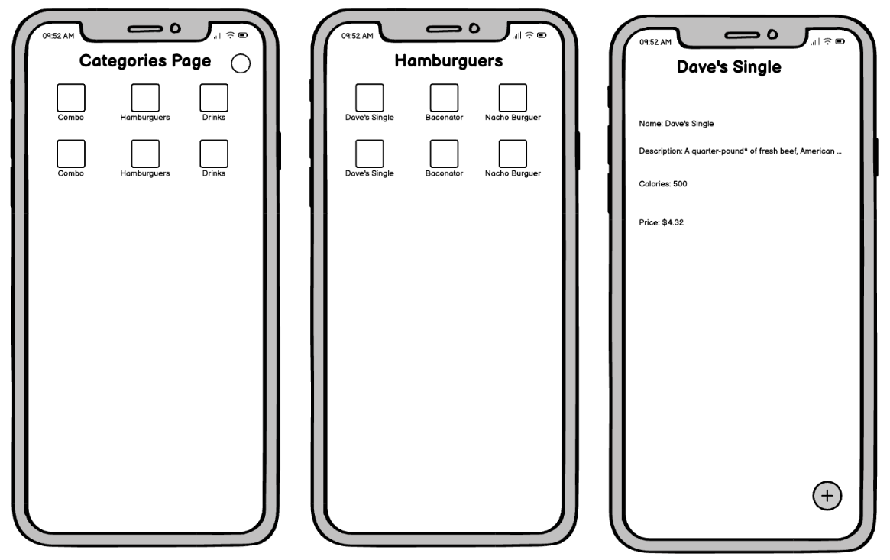
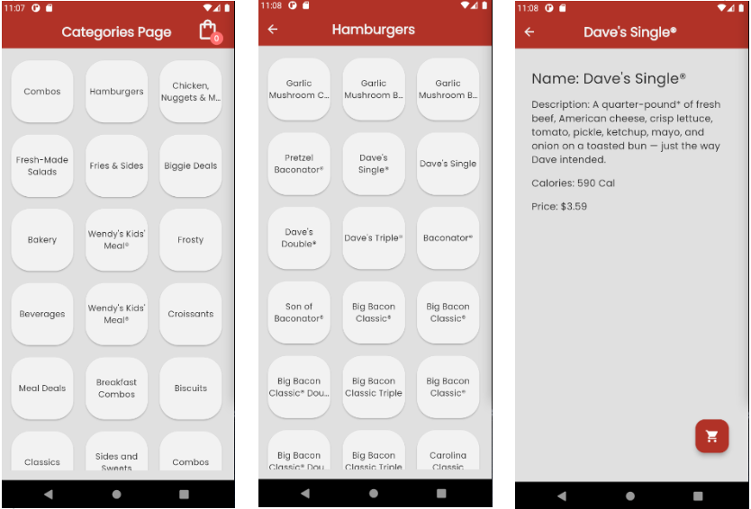

# Nav Code Challenge

- [Flutter version] 3.22.1
- [Dart version] 3.4.1

## Project Description
This project aims to integrate with the GetSiteMenu endpoint of Wendy's, which provides detailed information about the restaurant's menu. The API returns a large amount of data, but for the purposes of this project, we will focus on extracting only the essential information.

By analyzing the JSON response returned by the endpoint, we aim to facilitate the understanding and manipulation of the menu data, allowing for a clear and efficient presentation of the options available to users. This project focuses not only on technical integration but also on architectural solutions, testing, and the implementation of pipelines.

## Getting Started

This project is a starting point for a Flutter application, focusing on the Android and iOS solutions.

To run the project, execute the following commands:
  `flutter clean`
  `flutter pub get`
  `flutter run`

To run the tests:
  `flutter test`

## Pipeline Configuration
The project includes two pipelines configured to optimize the development workflow and ensure code quality:

- Pull Request Workflow
- Build Workflow

## Mockup and Screen Shots

Mockup

Screens

